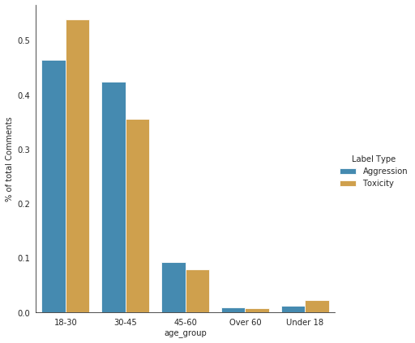
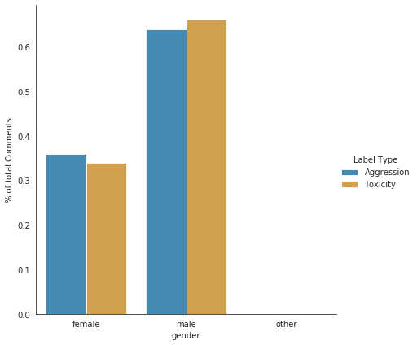
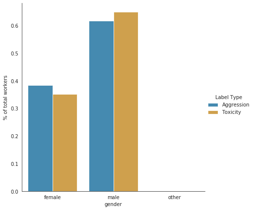
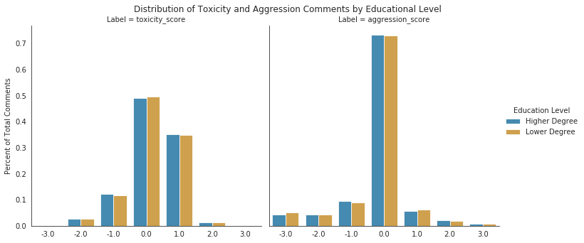
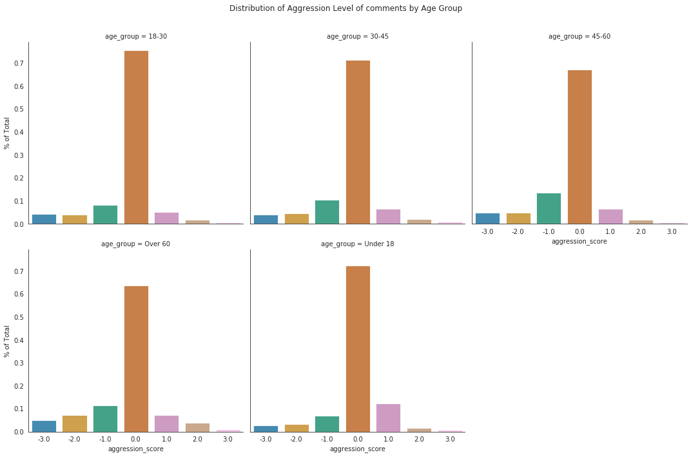
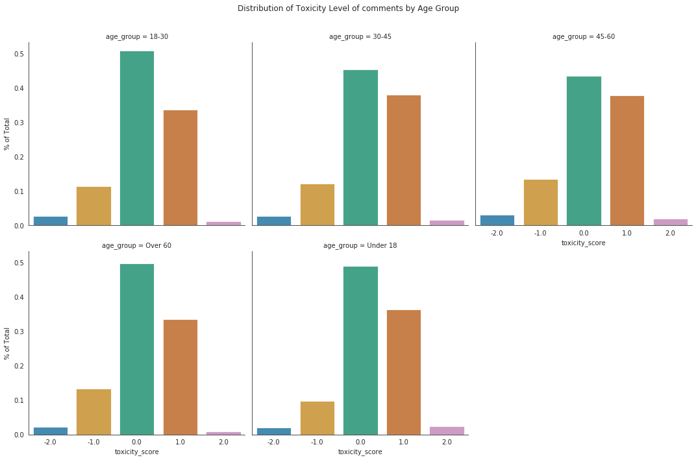

# DATA 512 FA2020
# A2: Bias in Data
Author: Juan Solorio

## Purpose
The goal of this assignment is to identify what, if any, sources of bias may exist in the Wikipedia Talk corpus and the implications that rise from these.

This assignment focuses on the annotations done for the [Wikipedia Talk]( https://meta.wikimedia.org/wiki/Research:Detox) corpus, consisting of three datasets. The dataset contains 160k labeled comments in English Wikipedia from an original corpus of 64M comments from discussions relating to user pages and articles dating from 2004-2015. Each of the comments were labeled by at least 10 annotators via Crowdflower for the level of toxicity, aggression, and personal attack of a comment in progressing or ending a discourse.
All the data collected by wikimedia can be accessed under free licenses via [figshare]( https://figshare.com/articles/Wikipedia_Talk_Labels_Toxicity/4563973) and per wikimedia [open access policy]( https://meta.wikimedia.org/wiki/Open_access_policy).

## Data Sources
This notebook will be focusing its exploratory analysis on the [aggression]( https://docs.google.com/spreadsheets/d/1IlhmnoAdHNm906WrwYp2el9tlZFfnJkwrYXzbEMKGvM/edit#gid=0&range=E3) and [toxicity]( https://docs.google.com/spreadsheets/d/1IlhmnoAdHNm906WrwYp2el9tlZFfnJkwrYXzbEMKGvM/edit#gid=0&range=E2) datasets:
- Aggression : 100k labeled comments from English Wikipedia by approximately 10 annotators via Crowdflower on how aggressive the comment was perceived to be.
- Toxicity : 160k labeled comments from English Wikipedia by approximately 10 annotators via Crowdflower on a spectrum of how toxic the comment is (perceived as likely to make people want to leave the discussion) to how healthy to conversation the contribution is.

Each of the datasets contains the following subsets:
- Annotated Comments: The comments put to revision from the corpus
- Annotations: The labels given to comment and the different workers who labeled them
- Demographics: Demographics of gender, age group, English as first language, and education for the workers

## Analysis Questions and Output
### Questions:
#### The primary focus in this notebook will be to answer the following about the datasets:
**Analyze the demographic information about the Crowdflower workers that is available in the dataset**
-	How evenly distributed are the gender and age demographics compared to the number of aggression comments reviewed?
-	Same question, but for the Toxicity dataset?
**Explore relationships between worker demographics and labeling behavior**
-	Are workers with Bachelors, Master's and Doctorate degrees more likely to label an a comment as aggression or toxic, than those with a different education degree?
-	Do we see an even distribution of rating for aggressive or toxic labels across age groups?

### Output

