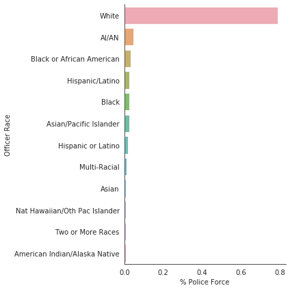
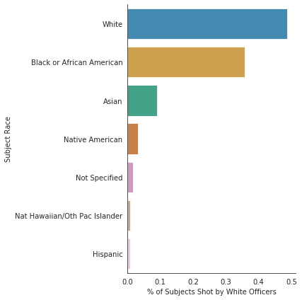
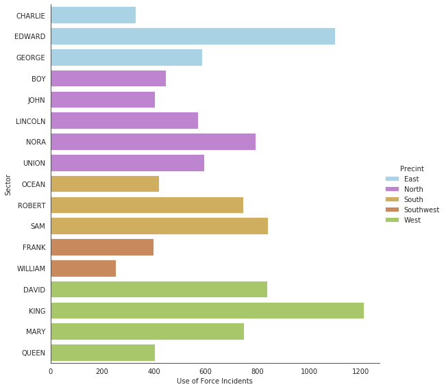
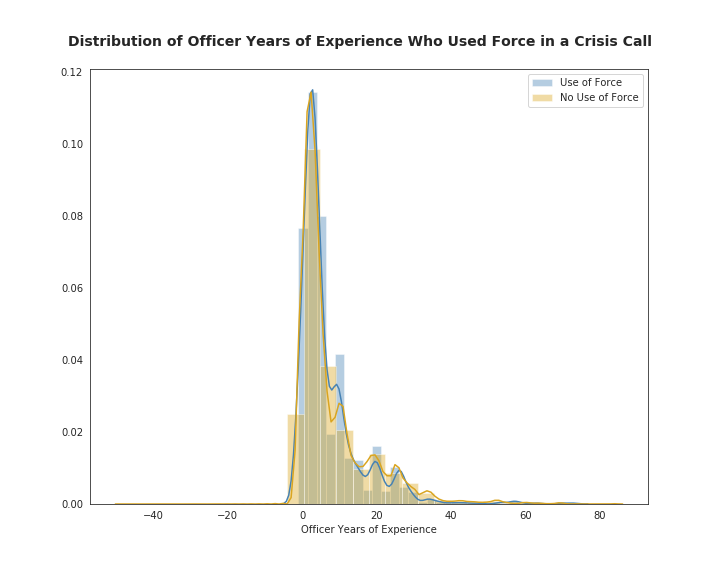

# Human Centered Data Science Final Project

**DATA 512 A Fall 2020** 

Juan Solorio


# Directory Structure
```bash
├── data-512-final
│   ├── .ipynb_checkpoints
│   ├── 1-Data
│   │   ├── data.Seattle.gov data for Police
│   │   ├── 2010 Census and 2019 estimates for King county populations
│   ├── 2-Figures
│   │   ├── Charts for the different research questions
│   │   ├── Images for Seattle police precincts
│   ├── 3-Analysis
│   │   ├── Initial Proposal.ipynb
│   │   ├── Final Project Report.ipynb
│   ├── LICENSE.txt
│   ├── README.md
│   └── README.md.save
└── .gitignore
```

## Proposal & Motivation

Police violence and excess force or police brutality have always been a major area of concern for citizens especially among minority and underrepresented communities. In more recent times, over the last few months we’ve experience the social unrest and rightful outcry through the use of protests and marches from these communities to call out said brutality. 
For this project I plan to explore the demographics of police officers involved in shootings and use of force from the city of Seattle to gain a better understanding as to how might this have an effect on the type of response taken by said officers.


## Data

For the project I will be using the data provided by the [City of Seattle Open Data Program]( https://data.seattle.gov/browse?category=Public+Safety&provenance=official&page=2). Primarily I will be using three datasets:
* [SPD Officer Involved Shooting]( https://data.seattle.gov/Public-Safety/SPD-Officer-Involved-Shooting-OIS-Data/mg5r-efcm) - Records of Officer Involved Shootings (OIS) from 2005 to the present, including a brief narrative synopsis. Data set does not contain records from active investigations. Data is visualized in a dashboard on the SPD public site


* [Police Use of Force]( https://data.seattle.gov/Public-Safety/Use-Of-Force/ppi5-g2bj) - Records representing Use of Force (UOF) by sworn law enforcement officers of the Seattle Police Department.


* [Seattle PD Officers respoding to Crisis Calls]( https://data.seattle.gov/Public-Safety/Crisis-Data/i2q9-thny). - Data representing crisis contacts made by officers of the Seattle Police Department. Data is denormalized to represent the one to many relationship between the record and the reported disposition of the contact.


These datasets contain demographic information on Police Officers involved in the offence as well as that of the civilian victim. The data also contains geographical and temporal information which could give better insights as to how these events are affected by location or time.

There will also be need to use some government census data to make some statistical comparisons for the Seattle area, but more specifically the King County region, which Seattle belongs to. We will use the population statistics from [Washington's Government data](https://www.ofm.wa.gov/washington-data-research/population-demographics/population-estimates/estimates-april-1-population-age-sex-race-and-hispanic-origin):
* [Race and Hispanic](https://www.ofm.wa.gov/sites/default/files/public/dataresearch/pop/asr/race/ofm_pop_race_2010_and_2019.xlsx) - Washington State Office of Financial Management, Forecasting and Research Division, numbers from the 2010 census and estimates for the 2019 population.


## Research Questions Explored

The project will focus to answer the following:
1. Are certain demographics of police officers more likely to be involved in shootings?
    - are there certain pairing of police-to-victim demographics that appear more in the data?
    
    
2. Is there a precinct (geographical location) that shows more propencity to using force?


3. Is there a relation between the years of experience and their response to a crisis?


## Key findings

* Effects of race can be seen in the demographics of police shootings
<tr>
<td>  </td>
<td>  </td>
</tr>

* West and East Precincts seem to have both highest numbers of Uses of Force incidents & propensity for more aggravated Force use
<tr>
<td>  </td>
</tr>


* Inconclusive results on how an officer’s years of experience affects how they respond in a crisis
<tr>
<td>  </td>
</tr>


## Licence

Plese refer to the project [MIT license](https://github.com/JUAN-SOLORIO/data-512/blob/main/data-512-final/LICENSE.txt) for more details.
